# RabbitMQ入门

## 介绍

​	MQ全称为Message Queue，即消息队列，RabbitMQ是由erlang语言开发，基于AMQP（Advanced Message
Queue 高级消息队列协议）协议实现的消息队列，它是一种应用程序之间的通信方法，消息队列在分布式系统开
发中应用非常广泛。RabbitMQ官方地址：http://www.rabbitmq.com/
开发中消息队列通常有如下应用场景：
1、任务异步处理。
将不需要同步处理的并且耗时长的操作由消息队列通知消息接收方进行异步处理。提高了应用程序的响应时间。
2、应用程序解耦合
MQ相当于一个中介，生产方通过MQ与消费方交互，它将应用程序进行解耦合。

市场上还有哪些消息队列？
ActiveMQ，RabbitMQ，ZeroMQ，Kafka，MetaMQ，RocketMQ、Redis。

为什么使用RabbitMQ呢？
1、使得简单，功能强大。
2、基于AMQP协议。
3、社区活跃，文档完善。
4、高并发性能好，这主要得益于Erlang语言。
5、Spring Boot默认已集成RabbitMQ

## RabbitMQ的工作原理

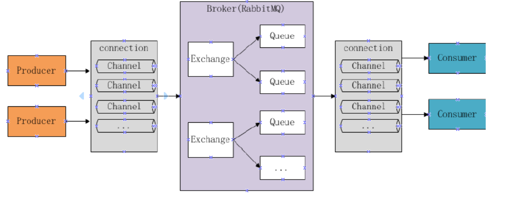

组成部分说明如下：
Broker：消息队列服务进程，此进程包括两个部分：Exchange和Queue。
Exchange：消息队列交换机，按一定的规则将消息路由转发到某个队列，对消息进行过虑。

Queue：消息队列，存储消息的队列，消息到达队列并Producer：消息生产者，即生产方客户端，生产方客户Consumer：消息消费者，即消费方客户端，接收MQ转发布接收流程：
发送消息-----
生产者和Broker建立TCP连接。
生产者和Broker建立通道。
生产者通过通道消息发送给Broker，由Exchange将消息进Exchange将消息转发到指定的Queue（队列）
接收消息-----
消费者和Broker建立TCP连接
消费者和Broker建立通道
消费者监听指定的Queue（队列）
当有消息到达Queue时Broker默认将消息推送给消费者。
消费者接收到消息。

## 环境搭建

### 下载安装

​	RabbitMQ由Erlang语言开发，Erlang语言用于并发及分布式系统的开发，在电信领域应用广泛，OTP（Open
Telecom Platform）作为Erlang语言的一部分，包含了很多基于Erlang开发的中间件及工具库，安装RabbitMQ需
要安装Erlang/OTP，并保持版本匹配，如下图：
RabbitMQ的下载地址：http://www.rabbitmq.com/download.html

本项目使用Erlang/OTP 20.3版本和RabbitMQ3.7.3版本

1）下载erlang
地址如下：
http://erlang.org/download/otp_win64_20.3.exe
或去老师提供的软件包中找到otp_win64_20.3.exe，以管理员方式运行此文件，安装。

erlang安装完成需要配置erlang环境变量：ERLANG_HOME=D:\Program Files\erl9.3 在path中添
加%ERLANG_HOME%\bin;

2）安装RabbitMQ
https://github.com/rabbitmq/rabbitmq-server/releases/tag/v3.7.3
或去老师提供的软件包中找到rabbitmq-server-3.7.3.exe，以管理员方式运行此文件，安装。

### 启动

```
RabbitMQ Service-install :安装服务
RabbitMQ Service-remove 删除服务
RabbitMQ Service-start 启动
RabbitMQ Service-stop 启动
```

### 安装管理插件

安装rabbitMQ的管理插件，方便在浏览器端管理RabbitMQ
管理员身份运行

```
rabbitmq-plugins.bat enable rabbitmq_management
```

### 启动成功登录RabbitMQ
```
进入浏览器，输入：

http://localhost:15672

初始账号和密码：

guest/guest
```


### 注意事项
1、安装erlang和rabbitMQ以管理员身份运行。
2、当卸载重新安装时会出现RabbitMQ服务注册失败，此时需要进入注册表清理erlang
搜索RabbitMQ、ErlSrv，将对应的项全部删除。

## 快速入门（使用rabbitMQjava客户端）

> 创建maven工程
> 创建生产者工程和消费者工程，分别加入RabbitMQ java client的依赖。
> test-rabbitmq-producer：生产者工程
> test-rabbitmq-consumer：消费者工程

### 生产者

在生产者工程下的test中创建测试类如下：

```xml
<dependency>
    <groupId>com.rabbitmq</groupId>
    <artifactId>amqp‐client</artifactId>
    <version>4.0.3</version><!‐‐此版本与spring boot 1.5.9版本匹配‐‐>
</dependency>
<dependency>
    <groupId>org.springframework.boot</groupId>
    <artifactId>spring‐boot‐starter‐logging</artifactId>
</dependency>
```


```java
public class Producer01 {
    //队列名称
    private static final String QUEUE = "helloworld";
    public static void main(String[] args) throws IOException, TimeoutException {
        Connection connection = null;
        Channel channel = null;
        try
        {
            ConnectionFactory factory = new ConnectionFactory();
            factory.setHost("localhost");
            factory.setPort(5672);
            factory.setUsername("guest");
            factory.setPassword("guest");
            factory.setVirtualHost("/");//rabbitmq默认虚拟机名称为“/”，虚拟机相当于一个独立的mq服务器
            //创建与RabbitMQ服务的TCP连接
            connection  = factory.newConnection();
            //创建与Exchange的通道，每个连接可以创建多个通道，每个通道代表一个会话任务
            channel = connection.createChannel();
            /**
             * 声明队列，如果Rabbit中没有此队列将自动创建
             * param1:队列名称
             * param2:是否持久化
             * param3:队列是否独占此连接
             * param4:队列不再使用时是否自动删除此队列
             * param5:队列参数  扩展参数 比如：设置存活时间
             */
            channel.queueDeclare(QUEUE, true, false, false, null);
            String message = "helloworld小明"+System.currentTimeMillis();
            /**
             * 消息发布方法
             * param1：Exchange的名称，如果没有指定，则使用Default Exchange
             * param2:routingKey,消息的路由Key，是用于Exchange（交换机）将消息转发到指定的消息队列
             * param3:消息包含的属性
             * param4：消息体
             */
             /**
             * 这里没有指定交换机，消息将发送给默认交换机，每个队列也会绑定那个默认的交换机，但是不能显
示绑定或解除绑定
             *  默认的交换机，routingKey等于队列名称
             */
            channel.basicPublish("", QUEUE, null, message.getBytes());
            System.out.println("Send Message is:'" + message + "'");
        }
        catch(Exception ex)
        {
            ex.printStackTrace();
        }
        finally
        {
            if(channel != null)
            {
                channel.close();
            }
            if(connection != null)
            {
                connection.close();
            }
        }
    }
}
```

 ###  消费者

在消费者工程下的test中创建测试类如下：

```java
public class Consumer01 {
private static final String QUEUE = "helloworld";
public static void main(String[] args) throws IOException, TimeoutException {
    ConnectionFactory factory = new ConnectionFactory();
    //设置MabbitMQ所在服务器的ip和端口
    factory.setHost("127.0.0.1");
    factory.setPort(5672);
    Connection connection = factory.newConnection();
    Channel channel = connection.createChannel();
    //声明队列
    channel.queueDeclare(QUEUE, true, false, false, null);
    //定义消费方法
    DefaultConsumer consumer = new DefaultConsumer(channel) {
        /**
         * 消费者接收消息调用此方法
         * @param consumerTag 消费者的标签，在channel.basicConsume()去指定
         * @param envelope 消息包的内容，可从中获取消息id，消息routingkey，交换机，消息和重传标志
         (收到消息失败后是否需要重新发送)
             * @param properties
             * @param body
             * @throws IOException
             */
            @Override
            public void handleDelivery(String consumerTag,
                                       Envelope envelope,
                                       AMQP.BasicProperties properties,
                                       byte[] body)
                    throws IOException {
                //交换机
                String exchange = envelope.getExchange();
                //路由key
                String routingKey = envelope.getRoutingKey();
                //消息id
                long deliveryTag = envelope.getDeliveryTag();
                //消息内容
                String msg = new String(body,"utf‐8");
                System.out.println("receive message.." + msg);
            }
        };
        /**
         * 监听队列String queue, boolean autoAck,Consumer callback
         * 参数明细
         * 1、队列名称
         * 2、是否自动回复，设置为true为表示消息接收到自动向mq回复接收到了，mq接收到回复会删除消息，设置
为false则需要手动回复
         * 3、消费消息的方法，消费者接收到消息后调用此方法
         */
        channel.basicConsume(QUEUE, true, consumer);
 
    }
}
```
 ### 总结

**1、发送端操作流程**
1）创建连接
2）创建通道
3）声明队列
4）发送消息

**2、接收端**
1）创建连接
2）创建通道
3）声明队列
4）监听队列
5）接收消息
6）ack回复

## 工作模式

```
RabbitMQ有以下几种工作模式：
1、Work queues
2、Publish/Subscribe
3、Routing
4、Topics
5、Header
6、RPC
```

### Work queues

queueswork queues与入门程序相比，多了一个消费端，两个消费端共同消费同一个队列中的消息。
应用场景：对于任务过重或任务较多情况使用工作队列可以提高任务处理的速度。
测试：
1、使用入门程序，启动多个消费者。
2、生产者发送多个消息。
结果：
1、一条消息只会被一个消费者接收；
2、rabbit采用轮询的方式将消息是平均发送给消费者的；
3、消费者在处理完某条消息后，才会收到下一条消息。

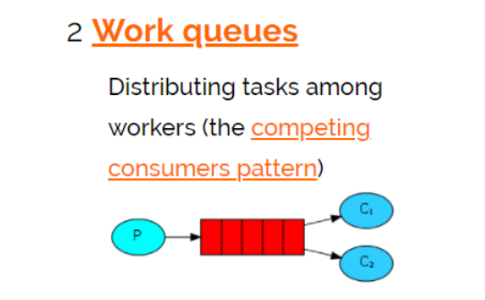

### Publish/subscribe

发布订阅模式：
1、每个消费者监听自己的队列。
2、生产者将消息发给broker，由交换机将消息转发到绑定此交换机的每个队列，每个绑定交换机的队列都将接收
到消息

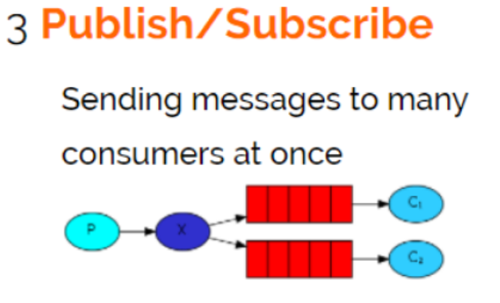

#### publish/subscribe与work queues有什么区别

1）work queues不用定义交换机，而publish/subscribe需要定义交换机。
2）publish/subscribe的生产方是面向交换机发送消息，work queues的生产方是面向队列发送消息(底层使用默交换机)。
3）publish/subscribe需要设置队列和交换机的绑定，work queues不需要设置，实质上work queues会将队列绑
定到默认的交换机。
**相同点：**
**所以两者实现的发布/订阅的效果是一样的，多个消费端监听同一个队列不会重复消费消息。**

2、实质工作用什么publish/subscribe还是work queues。
建议使用publish/subscribe，发布订阅模式比工作队列模式更强大，并且发布订阅模式可以指定自己专用的交换
机。


**代码**

1、生产者
声明Exchange_fanout_inform交换机。
声明两个队列并且绑定到此交换机，绑定时不需要指定routingkey
发送消息时不需要指定routingkey

```java
package com.xuecheng.test.rabbitmq;
 
import com.rabbitmq.client.*;
 
import java.io.IOException;
import java.util.concurrent.TimeoutException;
 
 
public class Producer02_publish {
    //队列名称
 private static final String QUEUE_INFORM_EMAIL = "queue_inform_email";
    private static final String QUEUE_INFORM_SMS = "queue_inform_sms";
    private static final String EXCHANGE_FANOUT_INFORM="exchange_fanout_inform";
    public static void main(String[] args) {
        Connection connection = null;
        Channel channel = null;
        try {
            //创建一个与MQ的连接
            ConnectionFactory factory = new ConnectionFactory();
            factory.setHost("127.0.0.1");
            factory.setPort(5672);
            factory.setUsername("guest");
            factory.setPassword("guest");
            factory.setVirtualHost("/");//rabbitmq默认虚拟机名称为“/”，虚拟机相当于一个独立的mq服务
器
 
            //创建一个连接
            connection = factory.newConnection();
            //创建与交换机的通道，每个通道代表一个会话
            channel = connection.createChannel();
            //声明交换机 String exchange, BuiltinExchangeType type
            /**
             * 参数明细
             * 1、交换机名称
             * 2、交换机类型，fanout、topic、direct、headers
             */
            channel.exchangeDeclare(EXCHANGE_FANOUT_INFORM, BuiltinExchangeType.FANOUT);
            //声明队列
//           (String queue, boolean durable, boolean exclusive, boolean autoDelete, Map<String, 
Object> arguments)
            /**
             * 参数明细：
             * 1、队列名称
             * 2、是否持久化
             * 3、是否独占此队列
             * 4、队列不用是否自动删除
             * 5、参数
             */
            channel.queueDeclare(QUEUE_INFORM_EMAIL, true, false, false, null);
            channel.queueDeclare(QUEUE_INFORM_SMS, true, false, false, null);
            //交换机和队列绑定String queue, String exchange, String routingKey
            /**
             * 参数明细
             * 1、队列名称
             * 2、交换机名称
             * 3、路由key
             */
            channel.queueBind(QUEUE_INFORM_EMAIL,EXCHANGE_FANOUT_INFORM,"");
            channel.queueBind(QUEUE_INFORM_SMS,EXCHANGE_FANOUT_INFORM,"");
            //发送消息
            for (int i=0;i<10;i++){
                String message = "inform to user"+i;
                //向交换机发送消息 String exchange, String routingKey, BasicProperties props, 
byte[] body
                /**
                 * 参数明细
                 * 1、交换机名称，不指令使用默认交换机名称 Default Exchange
                 * 2、routingKey（路由key），根据key名称将消息转发到具体的队列，这里填写队列名称息将发到此队列
                 * 3、消息属性
                 * 4、消息内容
                 */
                channel.basicPublish(EXCHANGE_FANOUT_INFORM, "", null, message.getBytes());
                System.out.println("Send Message is:'" + message + "'");
            }
 
        } catch (IOException e) {
            e.printStackTrace();
        } catch (TimeoutException e) {
            e.printStackTrace();
        }finally{
            if(channel!=null){
                try {
                    channel.close();
                } catch (IOException e) {
                    e.printStackTrace();
                } catch (TimeoutException e) {
                    e.printStackTrace();
                }
            }
            if(connection!=null){
                try {
                    connection.close();
                } catch (IOException e) {
                    e.printStackTrace();
                }
            }
 
        }
 
 
    }
}
```

2、邮件发送消费者

```java
 
package com.xuecheng.test.rabbitmq;
 
import com.rabbitmq.client.*;
 
import java.io.IOException;
import java.util.concurrent.TimeoutException;
/**
 * @author Administrator
 * @version 1.0
 * @create 2018‐06‐14 10:32
 **/
public class Consumer02_subscribe_email {
    //队列名称
    private static final String QUEUE_INFORM_EMAIL = "inform_queue_email";
    private static final String EXCHANGE_FANOUT_INFORM="inform_exchange_fanout";
 
    public static void main(String[] args) throws IOException, TimeoutException {
        //创建一个与MQ的连接
        ConnectionFactory factory = new ConnectionFactory();
        factory.setHost("127.0.0.1");
        factory.setPort(5672);
        factory.setUsername("guest");
        factory.setPassword("guest");
        factory.setVirtualHost("/");//rabbitmq默认虚拟机名称为“/”，虚拟机相当于 
        //创建一个连接
        Connection connection = factory.newConnection();
        //创建与交换机的通道，每个通道代表一个会话
        Channel channel = connection.createChannel();
        //声明交换机 String exchange, BuiltinExchangeType type
        /**
         * 参数明细
         * 1、交换机名称
         * 2、交换机类型，fanout、topic、direct、headers
         */
        channel.exchangeDeclare(EXCHANGE_FANOUT_INFORM, BuiltinExchangeType.        //声明队列
//            channel.queueDeclare(String queue, boolean durable, boolean exclusive, autoDelete, Map<String, Object> arguments)
        /**
         * 参数明细：
         * 1、队列名称
         * 2、是否持久化
         * 3、是否独占此队列
         * 4、队列不用是否自动删除
         * 5、参数
         */
        channel.queueDeclare(QUEUE_INFORM_EMAIL, true, false, false, null);
        //交换机和队列绑定String queue, String exchange, String routingKey
        /**
         * 参数明细
         * 1、队列名称
         * 2、交换机名称
         * 3、路由key
         */
        channel.queueBind(QUEUE_INFORM_EMAIL,EXCHANGE_FANOUT_INFORM,"");
        //定义消费方法
        DefaultConsumer defaultConsumer = new DefaultConsumer(channel) {
            @Override
 public void handleDelivery(String consumerTag, Envelope envelope, 
AMQP.BasicProperties properties, byte[] body) throws IOException {
                long deliveryTag = envelope.getDeliveryTag();
                String exchange = envelope.getExchange();
                //消息内容
                String message = new String(body, "utf‐8");
                System.out.println(message);
            }
        };
        /**
         * 监听队列String queue, boolean autoAck,Consumer callback
         * 参数明细
         * 1、队列名称
         * 2、是否自动回复，设置为true为表示消息接收到自动向mq回复接收到了，mq接收到回复会删除消息，设置
为false则需要手动回复
         * 3、消费消息的方法，消费者接收到消息后调用此方法
         */
        channel.basicConsume(QUEUE_INFORM_EMAIL, true, defaultConsumer);
 
 
    }
}

```

按照上边的代码，编写邮件通知的消费代码。
3、短信发送消费者
参考上边的邮件发送消费者代码编写。

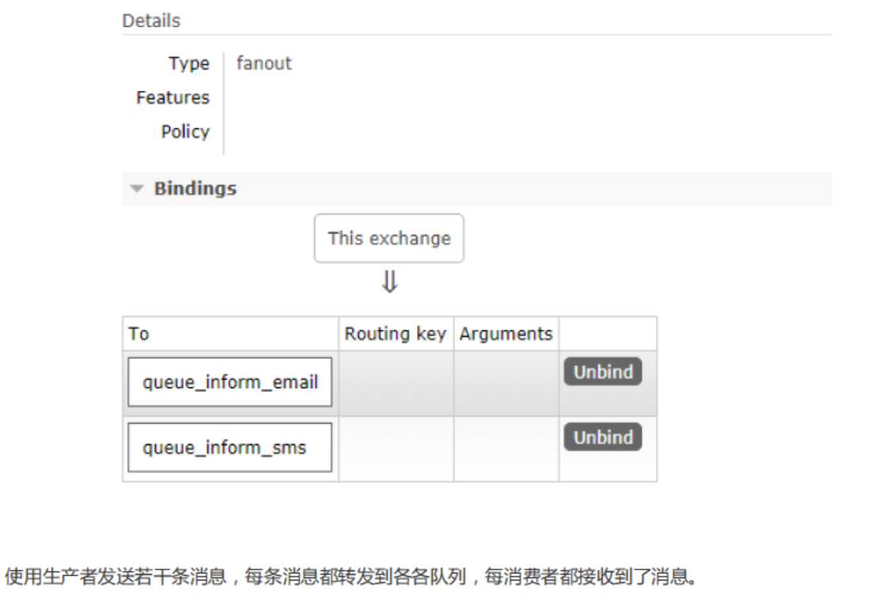

### Routing

路由模式：
1、每个消费者监听自己的队列，并且设置routingkey。
2、生产者将消息发给交换机，由交换机根据routingkey来转发消息到指定的队列。

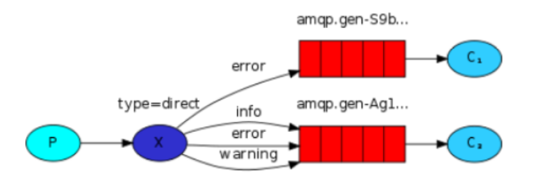

**代码**

1、生产者
声明exchange_routing_inform交换机。
声明两个队列并且绑定到此交换机，绑定时需要指定routingkey
发送消息时需要指定routingkey

```java
  package com.xuecheng.test.rabbitmq;
 
import com.rabbitmq.client.BuiltinExchangeType;
import com.rabbitmq.client.Channel;
import com.rabbitmq.client.Connection;
import com.rabbitmq.client.ConnectionFactory;
 
import java.io.IOException;
import java.util.concurrent.TimeoutException;
 
 
public class Producer03_routing {
    //队列名称
    private static final String QUEUE_INFORM_EMAIL = "queue_inform_email";
    private static final String QUEUE_INFORM_SMS = "queue_inform_sms";
    private static final String EXCHANGE_ROUTING_INFORM="exchange_routing_inform";
    public static void main(String[] args) {
        Connection connection = null;
        Channel channel = null;
        try {
            //创建一个与MQ的连接
            ConnectionFactory factory = new ConnectionFactory();
            factory.setHost("127.0.0.1");
            factory.setPort(5672);
            factory.setUsername("guest");
            factory.setPassword("guest");
            factory.setVirtualHost("/");//rabbitmq默认虚拟机名称为“/”，虚拟机相当于一个独立的mq服务器
            //创建一个连接
            connection = factory.newConnection();
            //创建与交换机的通道，每个通道代表一个会话
            channel = connection.createChannel();
            //声明交换机 String exchange, BuiltinExchangeType type
            /**
             * 参数明细
             * 1、交换机名称
             * 2、交换机类型，fanout、topic、direct、headers
             */
            channel.exchangeDeclare(EXCHANGE_ROUTING_INFORM, BuiltinExchangeType.DIRECT);
            //声明队列
//            channel.queueDeclare(String queue, boolean durable, boolean exclusive, boolean 
autoDelete, Map<String, Object> arguments)
            /**
             * 参数明细：
             * 1、队列名称
             * 2、是否持久化
             * 3、是否独占此队列
             * 4、队列不用是否自动删除
             * 5、参数
             */
            channel.queueDeclare(QUEUE_INFORM_EMAIL, true, false, false, null);
            channel.queueDeclare(QUEUE_INFORM_SMS, true, false, false, null);
            //交换机和队列绑定String queue, String exchange, String routingKey
            /**
             * 参数明细
             * 1、队列名称
             * 2、交换机名称
             * 3、路由key
             */
            channel.queueBind(QUEUE_INFORM_EMAIL,EXCHANGE_ROUTING_INFORM,QUEUE_INFORM_EMAIL);
            channel.queueBind(QUEUE_INFORM_SMS,EXCHANGE_ROUTING_INFORM,QUEUE_INFORM_SMS);
            //发送邮件消息
            for (int i=0;i<10;i++){
                String message = "email inform to user"+i;
                //向交换机发送消息 String exchange, String routingKey, BasicProperties props, 
byte[] body
                /**
                 * 参数明细
                 * 1、交换机名称，不指令使用默认交换机名称 Default Exchange
                 * 2、routingKey（路由key），根据key名称将消息转发到具体的队列，这里填写队列名称表示消
息将发到此队列
                 * 3、消息属性
                 * 4、消息内容
                 */
                channel.basicPublish(EXCHANGE_ROUTING_INFORM, QUEUE_INFORM_EMAIL, null, 
message.getBytes());
                System.out.println("Send Message is:'" + message + "'");
            }
            //发送短信消息
            for (int i=0;i<10;i++){
                String message = "sms inform to user"+i;
                //向交换机发送消息 String exchange, String routingKey, BasicProperties props, 
byte[] body
                channel.basicPublish(EXCHANGE_ROUTING_INFORM, QUEUE_INFORM_SMS, null, 
message.getBytes());
                System.out.println("Send Message is:'" + message + "'");
            }
 
        } catch (IOException e) {
            e.printStackTrace();
        } catch (TimeoutException e) {
            e.printStackTrace();
        }finally{
            if(channel!=null){
                try {
                    channel.close();
                } catch (IOException e) {
                    e.printStackTrace();
                } catch (TimeoutException e) {
                    e.printStackTrace();
                }
            }
            if(connection!=null){
                try {
                    connection.close();
                } catch (IOException e) {
                    e.printStackTrace();
                }
            }
 
        }
 
 
    }
}
```

2、信息发送消费者

```java
 
message.getBytes());
                System.out.println("Send Message is:'" + message + "'");
            }
            //发送短信消息
            for (int i=0;i<10;i++){
                String message = "sms inform to user"+i;
                //向交换机发送消息 String exchange, String routingKey, BasicProperties props, 
byte[] body
                channel.basicPublish(EXCHANGE_ROUTING_INFORM, QUEUE_INFORM_SMS, null, 
message.getBytes());
                System.out.println("Send Message is:'" + message + "'");
            }
 
        } catch (IOException e) {
            e.printStackTrace();
        } catch (TimeoutException e) {
            e.printStackTrace();
        }finally{
            if(channel!=null){
                try {
                    channel.close();
                } catch (IOException e) {
                    e.printStackTrace();
                } catch (TimeoutException e) {
                    e.printStackTrace();
                }
            }
            if(connection!=null){
                try {
                    connection.close();
                } catch (IOException e) {
                    e.printStackTrace();
                }
            }
 
        }
 
 
    }
}

```

2、邮件发送消费者

```java
 
package com.xuecheng.test.rabbitmq;
 
import com.rabbitmq.client.*;
 
import java.io.IOException;
import java.util.concurrent.TimeoutException;
 
 
public class Consumer03_routing_email {
    //队列名称
    private static final String QUEUE_INFORM_EMAIL = "inform_queue_email";
    private static final String EXCHANGE_ROUTING_INFORM="inform_exchange_routing";
 
    public static void main(String[] args) throws IOException, TimeoutException {
        //创建一个与MQ的连接
        ConnectionFactory factory = new ConnectionFactory();
        factory.setHost("127.0.0.1");
        factory.setPort(5672);
        factory.setUsername("guest");
        factory.setPassword("guest");
        factory.setVirtualHost("/");//rabbitmq默认虚拟机名称为“/”，虚拟机相当于一个独立的mq服务器
 
        //创建一个连接
        Connection connection = factory.newConnection();
        //创建与交换机的通道，每个通道代表一个会话
        Channel channel = connection.createChannel();
        //声明交换机 String exchange, BuiltinExchangeType type
        /**
         * 参数明细
         * 1、交换机名称
         * 2、交换机类型，fanout、topic、direct、headers
         */
        channel.exchangeDeclare(EXCHANGE_ROUTING_INFORM, BuiltinExchangeType.DIRECT);
        //声明队列
//            channel.queueDeclare(String queue, boolean durable, boolean exclusive, boolean 
autoDelete, Map<String, Object> arguments)
        /**
         * 参数明细：
         * 1、队列名称
         * 2、是否持久化
         * 3、是否独占此队列
         * 4、队列不用是否自动删除
         * 5、参数
         */
        channel.queueDeclare(QUEUE_INFORM_EMAIL, true, false, false, null);
        //交换机和队列绑定String queue, String exchange, String routingKey
        /**
         * 参数明细
         * 1、队列名称
         * 2、交换机名称
         * 3、路由key
         */
        channel.queueBind(QUEUE_INFORM_EMAIL,EXCHANGE_ROUTING_INFORM,QUEUE_INFORM_EMAIL);
        //定义消费方法
        DefaultConsumer defaultConsumer = new DefaultConsumer(channel) {
            @Override
            public void handleDelivery(String consumerTag, Envelope envelope, 
AMQP.BasicProperties properties, byte[] body) throws IOException {
                long deliveryTag = envelope.getDeliveryTag();
                String exchange = envelope.getExchange();
                //消息内容
                String message = new String(body, "utf‐8");
                System.out.println(message);
            }
        };
        /**
         * 监听队列String queue, boolean autoAck,Consumer callback
         * 参数明细
         * 1、队列名称
         * 2、是否自动回复，设置为true为表示消息接收到自动向mq回复接收到了，mq接收到回复会删除消息，设置
为false则需要手动回复
         * 3、消费消息的方法，消费者接收到消息后调用此方法
         */
        channel.basicConsume(QUEUE_INFORM_EMAIL, true, defaultConsumer);
 
 
    }
}
```

3、短信发送消费者
参考邮件发送消费者的代码流程，编写短信通知的代码。

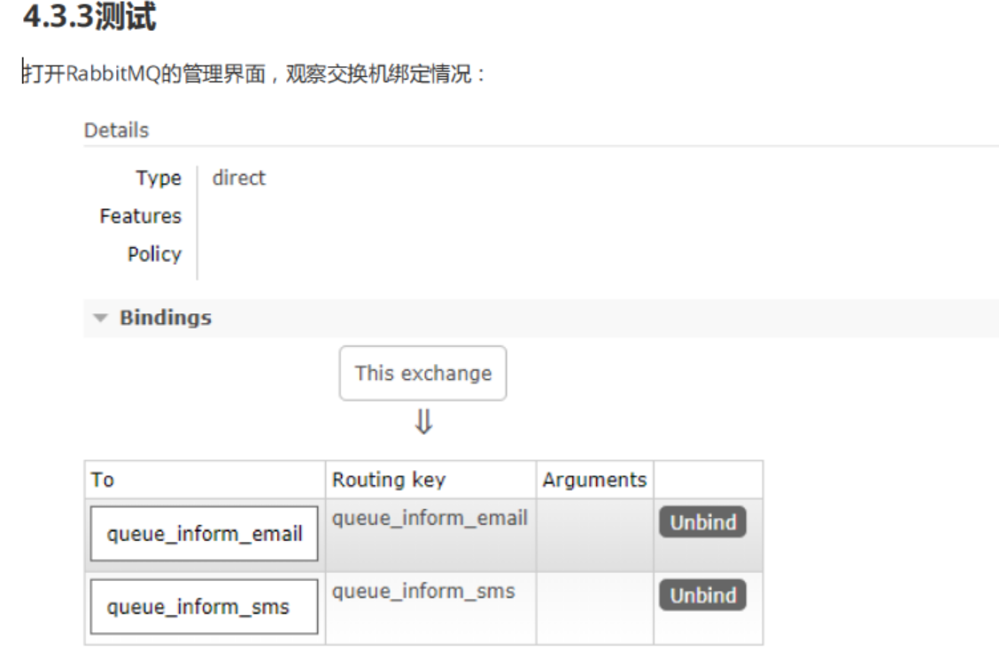

### Topics

主题模式：
1、每个消费者监听自己的队列，并且设置带统配符的routingkey。
2、生产者将消息发给broker，由交换机根据routingkey来转发消息到指定的队列。

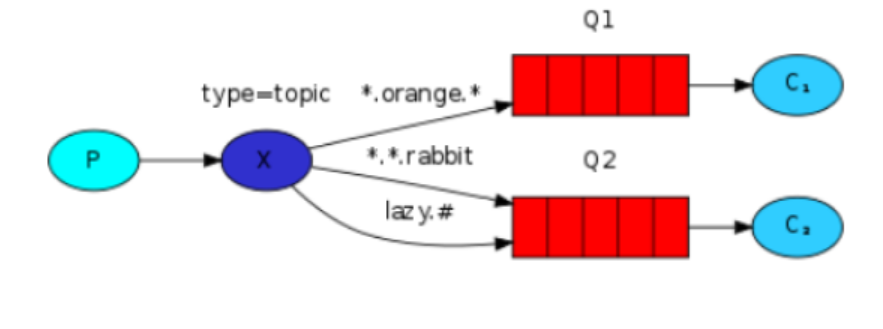

案例：
根据用户的通知设置去通知用户，设置接收Email的用户只接收Email，设置接收sms的用户只接收sms，设置两种
通知类型都接收的则两种通知都有效。
1、生产者
声明交换机，指定topic类型：

```java

/**
 * 声明交换机
 * param1：交换机名称
 * param2:交换机类型 四种交换机类型：direct、fanout、topic、headers
 */
 channel.exchangeDeclare(EXCHANGE_TOPICS_INFORM, BuiltinExchangeType.TOPIC);
//Email通知
channel.basicPublish(EXCHANGE_TOPICS_INFORM, "inform.email", null, message.getBytes());
//sms通知
channel.basicPublish(EXCHANGE_TOPICS_INFORM, "inform.sms", null, message.getBytes());
//两种都通知
channel.basicPublish(EXCHANGE_TOPICS_INFORM, "inform.sms.email", null, message.getBytes());
```

```java
//完整代码：
package com.xuecheng.test.rabbitmq;
 
import com.rabbitmq.client.BuiltinExchangeType;
import com.rabbitmq.client.Channel;
import com.rabbitmq.client.Connection;
import com.rabbitmq.client.ConnectionFactory;
 
import java.io.IOException;
import java.util.concurrent.TimeoutException;
 
public class Producer04_topics {
    //队列名称
    private static final String QUEUE_INFORM_EMAIL = "queue_inform_email";
    private static final String QUEUE_INFORM_SMS = "queue_inform_sms";
    private static final String EXCHANGE_TOPICS_INFORM="exchange_topics_inform";
    public static void main(String[] args) {
        Connection connection = null;
        Channel channel = null;
        try {
            //创建一个与MQ的连接
            ConnectionFactory factory = new ConnectionFactory();
            factory.setHost("127.0.0.1");
            factory.setPort(5672);
            factory.setUsername("guest");
            factory.setPassword("guest");
            factory.setVirtualHost("/");//rabbitmq默认虚拟机名称为“/”，虚拟机相当于一个独立的mq服务
器
 
            //创建一个连接
            connection = factory.newConnection();
            //创建与交换机的通道，每个通道代表一个会话
            channel = connection.createChannel();
            //声明交换机 String exchange, BuiltinExchangeType type
            /**
             * 参数明细
              * 1、交换机名称
             * 2、交换机类型，fanout、topic、direct、headers
             */
            channel.exchangeDeclare(EXCHANGE_TOPICS_INFORM, BuiltinExchangeType.TOPIC);
            //声明队列
            /**
             * 参数明细：
             * 1、队列名称
             * 2、是否持久化
             * 3、是否独占此队列
             * 4、队列不用是否自动删除
             * 5、参数
             */
            channel.queueDeclare(QUEUE_INFORM_EMAIL, true, false, false, null);
            channel.queueDeclare(QUEUE_INFORM_SMS, true, false, false, null);
 
            //发送邮件消息
            for (int i=0;i<10;i++){
                String message = "email inform to user"+i;
                //向交换机发送消息 String exchange, String routingKey, BasicProperties props, 
byte[] body
                /**
                 * 参数明细
                 * 1、交换机名称，不指令使用默认交换机名称 Default Exchange
                 * 2、routingKey（路由key），根据key名称将消息转发到具体的队列，这里填写队列名称表示消
息将发到此队列
                 * 3、消息属性
                 * 4、消息内容
                 */
                channel.basicPublish(EXCHANGE_TOPICS_INFORM, "inform.email", null, 
message.getBytes());
                System.out.println("Send Message is:'" + message + "'");
            }
            //发送短信消息
            for (int i=0;i<10;i++){
                String message = "sms inform to user"+i;
                channel.basicPublish(EXCHANGE_TOPICS_INFORM, "inform.sms", null, 
message.getBytes());
                System.out.println("Send Message is:'" + message + "'");
            }
            //发送短信和邮件消息
            for (int i=0;i<10;i++){
                String message = "sms and email inform to user"+i;
                channel.basicPublish(EXCHANGE_TOPICS_INFORM, "inform.sms.email", null, 
message.getBytes());
                System.out.println("Send Message is:'" + message + "'");
            }
 
        } catch (IOException e) {
            e.printStackTrace();
        } catch (TimeoutException e) {
            e.printStackTrace();
        }finally{
if(channel!=null){
                try {
                    channel.close();
                } catch (IOException e) {
                    e.printStackTrace();
                } catch (TimeoutException e) {
                    e.printStackTrace();
                }
            }
            if(connection!=null){
                try {
                    connection.close();
                } catch (IOException e) {
                    e.printStackTrace();
                }
            }
 
        }
 
 
    }
}

```

2、消费端

```java
 //声明队列
channel.queueDeclare(QUEUE_INFORM_EMAIL, true, false, false, null);
channel.queueDeclare(QUEUE_INFORM_SMS, true, false, false, null);
//声明交换机
channel.exchangeDeclare(EXCHANGE_TOPICS_INFORM, BuiltinExchangeType.TOPIC);
//绑定email通知队列
channel.queueBind(QUEUE_INFORM_EMAIL,EXCHANGE_TOPICS_INFORM,"inform.#.email.#");
//绑定sms通知队列
 channel.queueBind(QUEUE_INFORM_SMS,EXCHANGE_TOPICS_INFORM,"inform.#.sms.#");
```

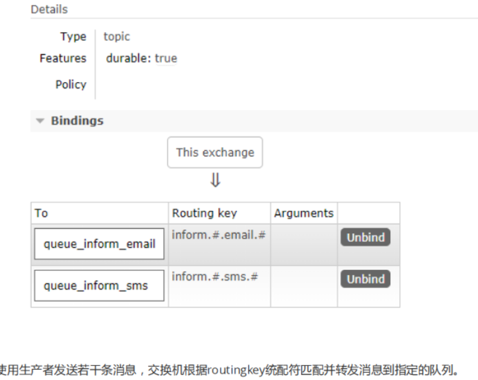

#### 思考

- 队列绑定交换机指定通配符：
  统配符规则：
  中间以“.”分隔。
  符号#可以匹配多个词(零个或多个)，符号*可以匹配一个词语(零个或一个)。
- 注意：#和*也可以表示匹配到0个词

**1、本案例的需求使用Routing工作模式能否实现？**
使用Routing模式也可以实现本案例，共设置三个routingkey，分别是email、sms、all，email队列绑定email和
all，sms队列绑定sms和all，这样就可以实现上边案例的功能，实现过程比topics复杂。
Topic模式更多加强大，它可以实现Routing、publish/subscirbe模式的功能。


### Header模式

>header模式与routing不同的地方在于，header模式取消routingkey，使用header中的key/value（键值对）匹配队列。

案例：
根据用户的通知设置去通知用户，设置接收Email的用户只接收Email，设置接收sms的用户只接收sms，设置两种
通知类型都接收的则两种通知都有效。
代码：
1）生产者
队列与交换机绑定的代码与之前不同，如下：

```
Map<String, Object> headers_email = new Hashtable<String, Object>();
headers_email.put("inform_type", "email");
Map<String, Object> headers_sms = new Hashtable<String, Object>();
headers_sms.put("inform_type", "sms");
channel.queueBind(QUEUE_INFORM_EMAIL,EXCHANGE_HEADERS_INFORM,"",headers_email);
channel.queueBind(QUEUE_INFORM_SMS,EXCHANGE_HEADERS_INFORM,"",headers_sms);
```

通知：

```
String message = "email inform to user"+i;
Map<String,Object> headers =  new Hashtable<String, Object>();
headers.put("inform_type", "email");//匹配email通知消费者绑定的header
//headers.put("inform_type", "sms");//匹配sms通知消费者绑定的header
AMQP.BasicProperties.Builder properties = new AMQP.BasicProperties.Builder();
properties.headers(headers);
//Email通知
channel.basicPublish(EXCHANGE_HEADERS_INFORM, "", properties.build(), message.getBytes());
```

发送邮件消费者：

```
channel.exchangeDeclare(EXCHANGE_HEADERS_INFORM, BuiltinExchangeType.HEADERS);
Map<String, Object> headers_email = new Hashtable<String, Object>();
headers_email.put("inform_email", "email");
//交换机和队列绑定
channel.queueBind(QUEUE_INFORM_EMAIL,EXCHANGE_HEADERS_INFORM,"",headers_email);
//指定消费队列
channel.basicConsume(QUEUE_INFORM_EMAIL, true, consumer);
```

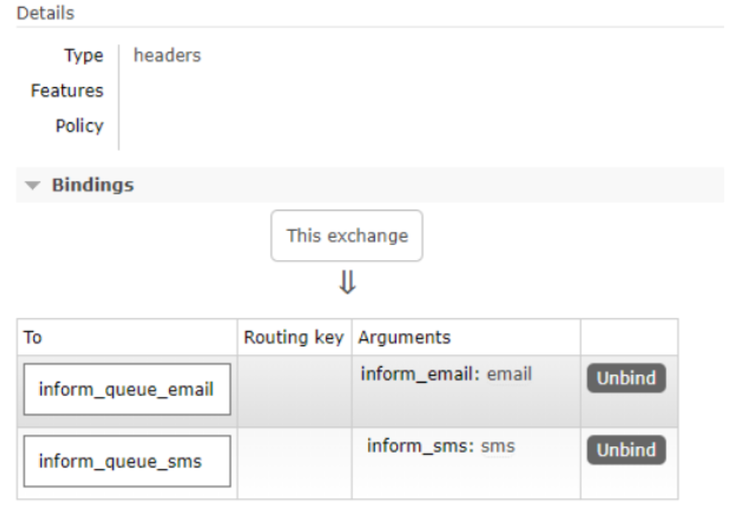

### RPC

RPC即客户端远程调用服务端的方法，使用MQ可以实现RPC的异步调用，基于Direct交换机实现，流程如下：
1、客户端即是生产者就是消费者，向RPC请求队列发送RPC调用消息，同时监听RPC响应队列。
2、服务端监听RPC请求队列的消息，收到消息后执行服务端的方法，得到方法返回的结果
3、服务端将RPC方法的结果发送到RPC响应队列
4、客户端（RPC调用方）监听RPC响应队列，接收到RPC调用结果

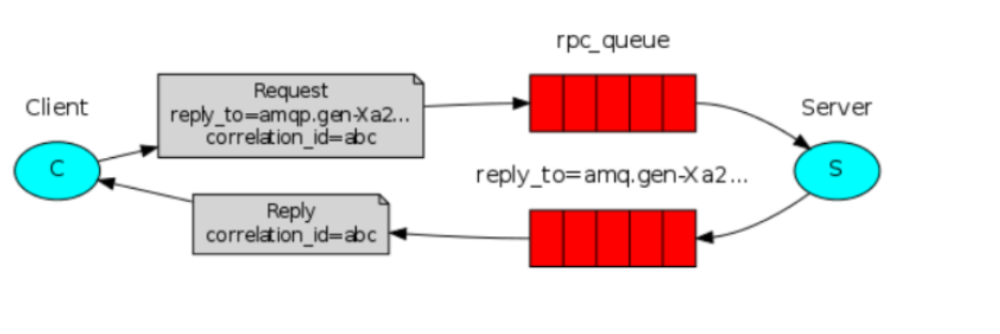

## Spring整合RibbitMQ

### 环境搭建

#### 依赖

我们选择基于Spring-Rabbit去操作RabbitMQ
https://github.com/spring-projects/spring-amqp
使用spring-boot-starter-amqp会自动添加spring-rabbit依赖，如下：

```xml
 <dependencies>
        <dependency>
            <groupId>org.springframework.boot</groupId>
            <artifactId>spring-boot-starter-amqp</artifactId>
        </dependency>
        <dependency>
            <groupId>org.springframework.boot</groupId>
            <artifactId>spring-boot-starter-test</artifactId>
        </dependency>
        <dependency>
            <groupId>org.springframework.boot</groupId>
            <artifactId>spring-boot-starter-logging</artifactId>
        </dependency>
    </dependencies>
```

#### 配置

1、配置application.yml
配置连接rabbitmq的参数

```yaml
server:
  port: 44000
spring:
  application:
    name: test-rabbitmq-producer
  rabbitmq:
    host: 127.0.0.1
    port: 5672
    username: guest
    password: guest
    virtualHost: /
```

### 定义RabbitConfig类，配置Exchange、Queue、及绑定交换机

本例配置Topic交换机。

```java
package com.xuecheng.test.rabbitmq.config;

import org.springframework.amqp.core.*;
import org.springframework.beans.factory.annotation.Qualifier;
import org.springframework.context.annotation.Bean;
import org.springframework.context.annotation.Configuration;
 
@Configuration
public class RabbitmqConfig {
    public static final String QUEUE_INFORM_EMAIL = "queue_inform_email";
    public static final String QUEUE_INFORM_SMS = "queue_inform_sms";
    public static final String EXCHANGE_TOPICS_INFORM="exchange_topics_inform";
 
 
    /**
     * 交换机配置
     * ExchangeBuilder提供了fanout、direct、topic、header交换机类型的配置
     * @return the exchange
     */
    @Bean(EXCHANGE_TOPICS_INFORM)
    public Exchange EXCHANGE_TOPICS_INFORM() {
      //durable(true)持久化，消息队列重启后交换机仍然存在
   
        return ExchangeBuilder.topicExchange(EXCHANGE_TOPICS_INFORM).durable(true).build();
    }
    //声明队列
    @Bean(QUEUE_INFORM_SMS)
    public Queue QUEUE_INFORM_SMS() {
        Queue queue = new Queue(QUEUE_INFORM_SMS);
        return queue;
    }
    //声明队列
    @Bean(QUEUE_INFORM_EMAIL)
    public Queue QUEUE_INFORM_EMAIL() {
        Queue queue = new Queue(QUEUE_INFORM_EMAIL);
        return queue;
    }
    /** channel.queueBind(INFORM_QUEUE_SMS,"inform_exchange_topic","inform.#.sms.#");
     * 绑定队列到交换机 .
     *
     * @param queue    the queue
     * @param exchange the exchange
     * @return the binding
     */
    @Bean
    public Binding BINDING_QUEUE_INFORM_SMS(@Qualifier(QUEUE_INFORM_SMS) Queue queue, 
@Qualifier(EXCHANGE_TOPICS_INFORM) Exchange exchange) {
        return BindingBuilder.bind(queue).to(exchange).with("inform.#.sms.#").noargs();
    }
    @Bean
    public Binding BINDING_QUEUE_INFORM_EMAIL(@Qualifier(QUEUE_INFORM_EMAIL) Queue queue, 
@Qualifier(EXCHANGE_TOPICS_INFORM) Exchange exchange) {
        return BindingBuilder.bind(queue).to(exchange).with("inform.#.email.#").noargs();
    }
}
```

### 生产端

使用RarbbitTemplate发送消息

```java
package com.xuecheng.test.rabbitmq;

import com.xuecheng.test.rabbitmq.config.RabbitmqConfig;
import org.junit.Test;
import org.junit.runner.RunWith;
import org.springframework.amqp.rabbit.core.RabbitTemplate;
import org.springframework.beans.factory.annotation.Autowired;
import org.springframework.boot.test.context.SpringBootTest;
import org.springframework.test.context.junit4.SpringRunner;

@SpringBootTest
@RunWith(SpringRunner.class)
public class Producer05_topics_springboot {
   @Autowired
    RabbitTemplate rabbitTemplate;

@Test
public void testSendByTopics(){
    for (int i=0;i<5;i++){
        String message = "sms email inform to user"+i;

rabbitTemplate.convertAndSend(RabbitmqConfig.EXCHANGE_TOPICS_INFORM,"inform.sms.email",message);
            System.out.println("Send Message is:'" + message + "'");
        }
    }
}
```

### 消费端

使用@RabbitListener注解监听队列

```java
package com.xuecheng.test.rabbitmq.mq;

import com.rabbitmq.client.Channel;
import com.xuecheng.test.rabbitmq.config.RabbitmqConfig;
import org.springframework.amqp.core.Message;
import org.springframework.amqp.rabbit.annotation.RabbitListener;
import org.springframework.stereotype.Component;

@Component
public class ReceiveHandler {

//监听email队列
@RabbitListener(queues = {RabbitmqConfig.QUEUE_INFORM_EMAIL})
public void receive_email(String msg,Message message,Channel channel){
    System.out.println(msg);
}
 
//监听sms队列
@RabbitListener(queues = {RabbitmqConfig.QUEUE_INFORM_SMS})
public void receive_sms(String msg,Message message,Channel channel){
    System.out.println(msg);
}

}
```

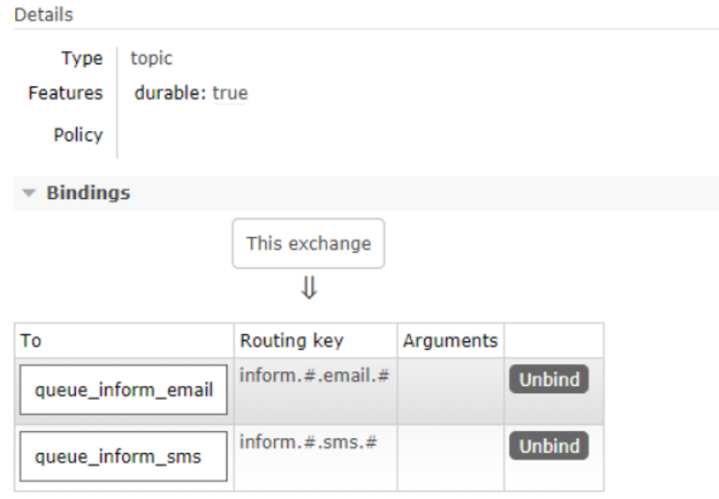