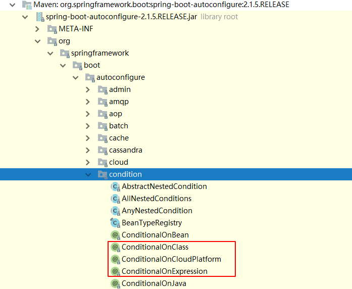

## **01-SpringBoot高级-今日内容**

 -  SpringBoot自定配置
- SpringBoot事件监听
- SpringBoot流程分析
- SpringBoot监控
- SpringBoot部署

## **02-SpringBoot自动配置-Condition-1**

 Condition是Spring4.0后引入的条件化配置接口，通过实现Condition接口可以完成有条件的加载相应的Bean

@Conditional要配和Condition的实现类（ClassCondition）进行使用

- ClassCondition

```java

public class ClassCondition implements Condition {
    /**
     *
     * @param context 上下文对象。用于获取环境，IOC容器，ClassLoader对象
     * @param metadata 注解元对象。 可以用于获取注解定义的属性值
     * @return
     */
    @Override
    public boolean matches(ConditionContext context, AnnotatedTypeMetadata metadata) {
      
        //1.需求： 导入Jedis坐标后创建Bean
        //思路：判断redis.clients.jedis.Jedis.class文件是否存在
        boolean flag = true;
        try {
            Class<?> cls = Class.forName("redis.clients.jedis.Jedis");
        } catch (ClassNotFoundException e) {
            flag = false;
        }
        return flag;
      
    }
}
```

- UserConfig

```java
@Configuration
public class UserConfig {

    @Bean
    @Conditional(ClassCondition.class)
    public User user(){
        return new User();
    }

}
```

测试

```java
@SpringBootApplication
public class SpringbootConditionApplication {

    public static void main(String[] args) {
        //启动SpringBoot的应用，返回Spring的IOC容器
        ConfigurableApplicationContext context = SpringApplication.run(SpringbootConditionApplication.class, args);

        Object user = context.getBean("user");
        System.out.println(user);

    }

}
```

## **03-SpringBoot自动配置-Condition-2**

 需求：将类的判断定义为动态的。判断哪个字节码文件存在可以动态指定。

自定义条件注解类

```java
import org.springframework.context.annotation.Conditional;

import java.lang.annotation.*;


@Target({ElementType.TYPE, ElementType.METHOD})
@Retention(RetentionPolicy.RUNTIME)
@Documented
@Conditional(ClassCondition.class)
public @interface ConditionOnClass {
    String[] value();
}
```

**注意：**此处@ConditionOnClass为自定义注解

```java
@Configuration
public class UserConfig {

    @Bean
    //@Conditional(ClassCondition.class)
    @ConditionOnClass("com.alibaba.fastjson.JSON")
    public User user(){
        return new User();
    }

    @Bean
    @ConditionalOnProperty(name = "itcast",havingValue = "itheima")
    public User user2(){
        return new User();
    }

}
```

测试User对象的创建

```java
@SpringBootApplication
public class SpringbootConditionApplication {

    public static void main(String[] args) {
        //启动SpringBoot的应用，返回Spring的IOC容器
        ConfigurableApplicationContext context = SpringApplication.run(SpringbootConditionApplication.class, args);

        Object user = context.getBean("user");
        System.out.println(user);

    }

}
```

查看条件注解源码




**SpringBoot 提供的常用条件注解：**

ConditionalOnProperty：判断配置文件中是否有对应属性和值才初始化Bean

ConditionalOnClass：判断环境中是否有对应字节码文件才初始化Bean

ConditionalOnMissingBean：判断环境中没有对应Bean才初始化Bean

## **04-SpringBoot自动配置-切换内置web服务器**

查看继承关系图


排除Tomcat


 

pom文件中的排除依赖效果

```xml
 <dependency>
            <groupId>org.springframework.boot</groupId>
            <artifactId>spring-boot-starter-web</artifactId>
            <!--排除tomcat依赖-->
            <exclusions>
                <exclusion>
                    <artifactId>spring-boot-starter-tomcat</artifactId>
                    <groupId>org.springframework.boot</groupId>
                </exclusion>
            </exclusions>
        </dependency>

        <!--引入jetty的依赖-->
        <dependency>
            <artifactId>spring-boot-starter-jetty</artifactId>
            <groupId>org.springframework.boot</groupId>
        </dependency>
```

## 05-SpringBoot自动配置-Enable注解原理

- SpringBoot不能直接获取在其他工程中定义的Bean

  演示代码：

  springboot-enable工程

  ```java
/**
   * @ComponentScan 扫描范围：当前引导类所在包及其子包
 *
   * com.itheima.springbootenable
   * com.itheima.config
   * //1.使用@ComponentScan扫描com.itheima.config包
   * //2.可以使用@Import注解，加载类。这些类都会被Spring创建，并放入IOC容器
   * //3.可以对Import注解进行封装。
   */
  
  //@ComponentScan("com.itheima.config")
  //@Import(UserConfig.class)
  @EnableUser
  @SpringBootApplication
  public class SpringbootEnableApplication {
  
      public static void main(String[] args) {
          ConfigurableApplicationContext context = SpringApplication.run(SpringbootEnableApplication.class, args);
  
       //获取Bean
          Object user = context.getBean("user");
          System.out.println(user);
  
  	}
  
  }
  ```
  
  pom中引入springboot-enable-other
  
  ```
 		<dependency>
              <groupId>com.itheima</groupId>
            <artifactId>springboot-enable-other</artifactId>
              <version>0.0.1-SNAPSHOT</version>
        </dependency>
  ```

  springboot-enable-other工程
  
  **UserConfig**
  
  ```java
  @Configuration
  public class UserConfig {

      @Bean
    public User user() {
          return new User();
    }
  
 
  }
  
  ```
  
  **EnableUser注解类**
  
  ```java
  import org.springframework.context.annotation.Import;
  
  import java.lang.annotation.*;
  
  @Target(ElementType.TYPE)
  @Retention(RetentionPolicy.RUNTIME)
@Documented
  @Import(UserConfig.class)
public @interface EnableUser {
  
}
  
```
  
  **原因**：@ComponentScan 扫描范围：当前引导类所在包及其子包
  
  **三种解决方案：**
  
  1.使用@ComponentScan扫描com.itheima.config包 
  
  2.可以使用@Import注解，加载类。这些类都会被Spring创建，并放入IOC容器
  
  3.可以对Import注解进行封装。
  
  **重点：Enable注解底层原理是使用@Import注解实现Bean的动态加载**

## **06-SpringBoot自动配置-@Import详解**

@Enable*底层依赖于@Import注解导入一些类，使用@Import导入的类会被Spring加载到IOC容器中。而@Import提供4中用法：

①导入Bean

②导入配置类

③导入 ImportSelector 实现类。一般用于加载配置文件中的类

④导入 ImportBeanDefinitionRegistrar 实现类。

- 导入Bean  @Import(User.class)

- 导入配置类  @Import(UserConfig.class)

- 导入 ImportSelector 实现类   @Import(MyImportSelector.class)

  MyImportSelector

  ```java
  public class MyImportSelector implements ImportSelector {
      @Override
      public String[] selectImports(AnnotationMetadata importingClassMetadata) {
          return new String[]{"com.itheima.domain.User", "com.itheima.domain.Role"};
      }
  }
  ```

- 导入 ImportBeanDefinitionRegistrar 实现类。@Import({MyImportBeanDefinitionRegistrar.class})

  ```java
  public class MyImportBeanDefinitionRegistrar implements ImportBeanDefinitionRegistrar {
      @Override
      public void registerBeanDefinitions(AnnotationMetadata importingClassMetadata, BeanDefinitionRegistry registry) {
          AbstractBeanDefinition beanDefinition = BeanDefinitionBuilder.rootBeanDefinition(User.class).getBeanDefinition();
          registry.registerBeanDefinition("user", beanDefinition);
  
  
      }
  }
  ```

  SpringbootEnableApplication测试代码

  ```java

  /**
 * Import4中用法：
   *  1. 导入Bean
   *  2. 导入配置类
   *  3. 导入ImportSelector的实现类。
   *  4. 导入ImportBeanDefinitionRegistrar实现类
   */
  
  //@Import(User.class)
  //@Import(UserConfig.class)
  //@Import(MyImportSelector.class)
  //@Import({MyImportBeanDefinitionRegistrar.class})
  
  @SpringBootApplication
  public class SpringbootEnableApplication {
  
      public static void main(String[] args) {
          ConfigurableApplicationContext context = SpringApplication.run(SpringbootEnableApplication.class, args);
  
          /*//获取Bean
          Object user = context.getBean("user");
          System.out.println(user);*/
  
          /*User user = context.getBean(User.class);
          System.out.println(user);
  
          Role role = context.getBean(Role.class);
          System.out.println(role);*/
  
        /*  Object user = context.getBean("user");
          System.out.println(user);*/
       Map<String, User> map = context.getBeansOfType(User.class);
          System.out.println(map);
  
      }
  
  }
  ```


@EnableAutoConfiguration中使用的是第三种方式：@Import(AutoConfigurationImportSelector.class)

## **07-SpringBoot自动配置-@EnableAutoConfiguration详解**


- @EnableAutoConfiguration 注解内部使用 @Import(AutoConfigurationImportSelector.**class**)来加载配置类。 

- 配置文件位置：META-INF/spring.factories，该配置文件中定义了大量的配置类，当 SpringBoot 应用启动时，会自动加载这些配置类，初始化Bean

- 并不是所有的Bean都会被初始化，在配置类中使用Condition来加载满足条件的Bean

## **08-SpringBoot自动配置-自定义starter步骤分析**

**需求：**自定义redis-starter。要求当导入redis坐标时，SpringBoot自动创建Jedis的Bean。

**步骤：**

①创建 redis-spring-boot-autoconfigure 模块

②创建 redis-spring-boot-starter 模块,依赖 redis-spring-boot-autoconfigure的模块

③在 redis-spring-boot-autoconfigure 模块中初始化 Jedis 的 Bean。并定义META-INF/spring.factories 文件

④在测试模块中引入自定义的 redis-starter 依赖，测试获取 Jedis 的Bean，操作 redis。

## **09-SpringBoot自动配置-自定义starter实现-1**

1. **创建redis-spring-boot-starter工程**

​         pom文件中引入redis-spring-boot-autoconfigure

```xml
 <!--引入configure-->
        <dependency>
            <groupId>com.itheima</groupId>
            <artifactId>redis-spring-boot-autoconfigure</artifactId>
            <version>0.0.1-SNAPSHOT</version>
        </dependency>
```

2. **创建redis-spring-boot-autoconfigure配置工程**  

创建RedisProperties配置文件参数绑定类 

```java
@ConfigurationProperties(prefix = "redis")
public class RedisProperties {

    private String host = "localhost";
    private int port = 6379;


    public String getHost() {
        return host;
    }

    public void setHost(String host) {
        this.host = host;
    }

    public int getPort() {
        return port;
    }

    public void setPort(int port) {
        this.port = port;
    }
}
```

 创建RedisAutoConfiguration自动配置类

```java
@Configuration
@EnableConfigurationProperties(RedisProperties.class)
public class RedisAutoConfiguration {


    /**
     * 提供Jedis的bean
     */
    @Bean
    public Jedis jedis(RedisProperties redisProperties) {
       
        return new Jedis(redisProperties.getHost(), redisProperties.getPort());
    }
}
```


在resource目录下创建META-INF文件夹并创建spring.factories

注意：”\ “是换行使用的

```properties
org.springframework.boot.autoconfigure.EnableAutoConfiguration=\
  com.itheima.redis.config.RedisAutoConfiguration
```

3. **在springboot-enable工程中引入自定义的redis的starter**

```
  <!--自定义的redis的starter-->
        <dependency>
            <groupId>com.itheima</groupId>
            <artifactId>redis-spring-boot-starter</artifactId>
            <version>0.0.1-SNAPSHOT</version>
        </dependency>
```

在SpringbootEnableApplication启动类中测试

```java
 Jedis jedis = context.getBean(Jedis.class);
        System.out.println(jedis);
```

## **10-SpringBoot自动配置-自定义starter实现-2**

测试springboot-enable工程中的application.properties中的配置参数

```properties
redis.port=6666
```

使用注解完成有条件加载配置类

```java
@Configuration
@EnableConfigurationProperties(RedisProperties.class)
@ConditionalOnClass(Jedis.class)
public class RedisAutoConfiguration {


    /**
     * 提供Jedis的bean
     */
    @Bean
    @ConditionalOnMissingBean(name = "jedis")
    public Jedis jedis(RedisProperties redisProperties) {
        System.out.println("RedisAutoConfiguration....");
        return new Jedis(redisProperties.getHost(), redisProperties.getPort());
    }
}
```

## **11-SpringBoot事件监听**

 Java中的事件监听机制定义了以下几个角色：

①事件：Event，继承 java.util.EventObject 类的对象

②事件源：Source ，任意对象Object

③监听器：Listener，实现 java.util.EventListener 接口 的对象


SpringBoot 在项目启动时，会对几个监听器进行回调，我们可以实现这些监听器接口，在项目启动时完成一些操作。

- ApplicationContextInitializer、

- SpringApplicationRunListener、

- CommandLineRunner、

- ApplicationRunner

  
  
  自定义监听器的启动时机：MyApplicationRunner和MyCommandLineRunner都是当项目启动后执行，使用@Component放入容器即可使用

MyApplicationRunner

```java
/**
 * 当项目启动后执行run方法。
 */
@Component
public class MyApplicationRunner implements ApplicationRunner {
    @Override
    public void run(ApplicationArguments args) throws Exception {
        System.out.println("ApplicationRunner...run");
        System.out.println(Arrays.asList(args.getSourceArgs()));
    }
} 
```

 MyCommandLineRunner

```java
@Component
public class MyCommandLineRunner implements CommandLineRunner {
    @Override
    public void run(String... args) throws Exception {
        System.out.println("CommandLineRunner...run");
        System.out.println(Arrays.asList(args));
    }
}

```


MyApplicationContextInitializer的使用要在resource文件夹下添加META-INF/spring.factories

```properties
org.springframework.context.ApplicationContextInitializer=com.itheima.springbootlistener.listener.MyApplicationContextInitializer
```

```
@Component
public class MyApplicationContextInitializer implements ApplicationContextInitializer {
    @Override
    public void initialize(ConfigurableApplicationContext applicationContext) {
        System.out.println("ApplicationContextInitializer....initialize");
    }
}
```

MySpringApplicationRunListener的使用要添加**构造器**

```
public class MySpringApplicationRunListener implements SpringApplicationRunListener {

    public MySpringApplicationRunListener(SpringApplication application, String[] args) {
    }

    @Override
    public void starting() {
        System.out.println("starting...项目启动中");
    }

    @Override
    public void environmentPrepared(ConfigurableEnvironment environment) {
        System.out.println("environmentPrepared...环境对象开始准备");
    }

    @Override
    public void contextPrepared(ConfigurableApplicationContext context) {
        System.out.println("contextPrepared...上下文对象开始准备");
    }

    @Override
    public void contextLoaded(ConfigurableApplicationContext context) {
        System.out.println("contextLoaded...上下文对象开始加载");
    }

    @Override
    public void started(ConfigurableApplicationContext context) {
        System.out.println("started...上下文对象加载完成");
    }

    @Override
    public void running(ConfigurableApplicationContext context) {
        System.out.println("running...项目启动完成，开始运行");
    }

    @Override
    public void failed(ConfigurableApplicationContext context, Throwable exception) {
        System.out.println("failed...项目启动失败");
    }
}
```

## **12-SpringBoot流程分析-初始化**

1.  配置启动引导类（判断是否有启动主类）

2. 判断是否是Web环境

3. 获取初始化类、监听器类

   


## **13-SpringBoot流程分析-run**

1. 启动计时器

2. 执行监听器

3. 准备环境

4.  打印banner：可以resource下粘贴自定义的banner

5. 创建context

   ```
   refreshContext(context);
   ```

   执行refreshContext方法后才真正创建Bean

   


## **14-SpringBoot监控-actuator基本使用**

 ①导入依赖坐标

```xml
<dependency>

  <groupId>org.springframework.boot</groupId>

  <artifactId>spring-boot-starter-actuator</artifactId>

</dependency>
```

②访问http://localhost:8080/acruator


```json
{
    "_links":{
        "self":{
            "href":"http://localhost:8080/actuator",
            "templated":false
        },
        "health":{
            "href":"http://localhost:8080/actuator/health",
            "templated":false
        },
        "health-component-instance":{
            "href":"http://localhost:8080/actuator/health/{component}/{instance}",
            "templated":true
        },
        "health-component":{
            "href":"http://localhost:8080/actuator/health/{component}",
            "templated":true
        },
        "info":{
            "href":"http://localhost:8080/actuator/info",
            "templated":false
        }
    }
}
```

http://localhost:8080/actuator/info

在application.properties中配置

```properties
info.name=lucy
info.age=99
```

http://localhost:8080/actuator/health

开启健康检查详细信息

```properties
management.endpoint.health.show-details=always
```

```json
{
    "status":"UP",
    "details":{
        "diskSpace":{
            "status":"UP",
            "details":{
                "total":159579508736,
                "free":13558104064,
                "threshold":10485760
            }
        },
        "redis":{
            "status":"UP",
            "details":{
                "version":"2.4.5"
            }
        }
    }
}
```

## **15-SpringBoot监控-actuator开启所有endpoint**

 开启所有endpoint

在application.properties中配置：

```properties
management.endpoints.web.exposure.include=*
```

开启所有endpoint的返回结果：

```properties
{
    "_links":{
        "self":{
            "href":"http://localhost:8080/actuator",
            "templated":false
        },
        "auditevents":{
            "href":"http://localhost:8080/actuator/auditevents",
            "templated":false
        },
        "beans":{
            "href":"http://localhost:8080/actuator/beans",
            "templated":false
        },
        "caches-cache":{
            "href":"http://localhost:8080/actuator/caches/{cache}",
            "templated":true
        },
        "caches":{
            "href":"http://localhost:8080/actuator/caches",
            "templated":false
        },
        "health-component-instance":{
            "href":"http://localhost:8080/actuator/health/{component}/{instance}",
            "templated":true
        },
        "health":{
            "href":"http://localhost:8080/actuator/health",
            "templated":false
        },
        "health-component":{
            "href":"http://localhost:8080/actuator/health/{component}",
            "templated":true
        },
        "conditions":{
            "href":"http://localhost:8080/actuator/conditions",
            "templated":false
        },
        "configprops":{
            "href":"http://localhost:8080/actuator/configprops",
            "templated":false
        },
        "env":{
            "href":"http://localhost:8080/actuator/env",
            "templated":false
        },
        "env-toMatch":{
            "href":"http://localhost:8080/actuator/env/{toMatch}",
            "templated":true
        },
        "info":{
            "href":"http://localhost:8080/actuator/info",
            "templated":false
        },
        "loggers":{
            "href":"http://localhost:8080/actuator/loggers",
            "templated":false
        },
        "loggers-name":{
            "href":"http://localhost:8080/actuator/loggers/{name}",
            "templated":true
        },
        "heapdump":{
            "href":"http://localhost:8080/actuator/heapdump",
            "templated":false
        },
        "threaddump":{
            "href":"http://localhost:8080/actuator/threaddump",
            "templated":false
        },
        "metrics-requiredMetricName":{
            "href":"http://localhost:8080/actuator/metrics/{requiredMetricName}",
            "templated":true
        },
        "metrics":{
            "href":"http://localhost:8080/actuator/metrics",
            "templated":false
        },
        "scheduledtasks":{
            "href":"http://localhost:8080/actuator/scheduledtasks",
            "templated":false
        },
        "httptrace":{
            "href":"http://localhost:8080/actuator/httptrace",
            "templated":false
        },
        "mappings":{
            "href":"http://localhost:8080/actuator/mappings",
            "templated":false
        }
    }
}
```

## **16-SpringBoot监控-springboot admin图形化界面使用**

SpringBoot Admin 有两个角色，客户端(Client)和服务端(Server)。

以下为创建服务端和客户端工程步骤：

admin-server：

①创建 admin-server 模块

②导入依赖坐标 admin-starter-server


```xml
      <dependency>
            <groupId>de.codecentric</groupId>
            <artifactId>spring-boot-admin-starter-server</artifactId>
        </dependency>
```

③在引导类上启用监控功能@EnableAdminServer

```java
@EnableAdminServer
@SpringBootApplication
public class SpringbootAdminServerApplication {

    public static void main(String[] args) {
        SpringApplication.run(SpringbootAdminServerApplication.class, args);
    }

}

```


admin-client：

①创建 admin-client 模块

②导入依赖坐标 admin-starter-client

```xml
  		<dependency>
            <groupId>de.codecentric</groupId>
            <artifactId>spring-boot-admin-starter-client</artifactId>
        </dependency>
```

③配置相关信息：server地址等

```properties
# 执行admin.server地址
spring.boot.admin.client.url=http://localhost:9000

management.endpoint.health.show-details=always
management.endpoints.web.exposure.include=*
```

④启动server和client服务，访问server

## **17-SpringBoot部署**

 

 SpringBoot 项目开发完毕后，支持两种方式部署到服务器：

①jar包(官方推荐)

②war包

**更改pom文件中的打包方式为war**

修改启动类

```java
import org.springframework.boot.SpringApplication;
import org.springframework.boot.autoconfigure.SpringBootApplication;
import org.springframework.boot.builder.SpringApplicationBuilder;
import org.springframework.boot.web.servlet.support.SpringBootServletInitializer;

@SpringBootApplication
public class SpringbootDeployApplication extends SpringBootServletInitializer {

    public static void main(String[] args) {
        SpringApplication.run(SpringbootDeployApplication.class, args);
    }


    @Override
    protected SpringApplicationBuilder configure(SpringApplicationBuilder builder) {
        return builder.sources(SpringbootDeployApplication.class);
    }
}

```


指定打包的名称

```xml
 <build>
        <finalName>springboot</finalName>
        <plugins>
            <plugin>
                <groupId>org.springframework.boot</groupId>
                <artifactId>spring-boot-maven-plugin</artifactId>
            </plugin>
        </plugins>
    </build>
```

