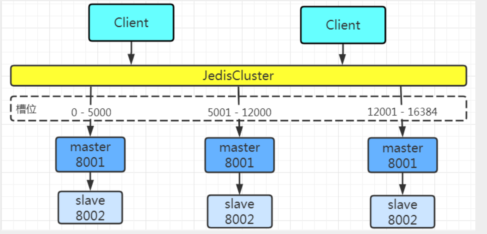
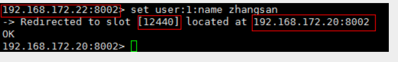

# 缓存知识考点

## 缓存中间件——Memcache和Redis的区别

- Memcache :代码层次类似Hash
- 支持简单数据类型 
- 不支持数据持久化存储 
- 不支持主从
-  不支持分片


  

- Redis数据类型丰富

- 支持数据磁盘持久化存储

- 支持主从

- 支持分片


## Redis数据类型

**String** :字符串类型

**Hash** : 散列类型，相当于Java中的map

**List** : 列表类型(list)：有序、可重复, Redis的list是采用来链表来存储的，所以对于redis的list数据类型的操作，是操作list的两端数据来操作的。

**Set** : 集合类型    集合类型：无序、不可重复

**Sortedset** : Sortedset又叫zset,Sortedset是有序集合，可排序的，但是唯一。Sortedset和set的不同之处，是会给set中的元素添加一个分数，然后通过这个分数进行排序。


## 从海量key里查询出某一固定前缀的key


> keys pattern 命令在redis服务器数据量过大时会造成客户端卡死


## 如何通过redis实现分布式锁


## 大量的key同时过期的注意项


## 如何使用redis做异步队列


**实例**

以下实例演示了发布订阅是如何工作的。在我们实例中我们创建了订阅频道名为 **redisChat**:

```shell
redis 127.0.0.1:6379> SUBSCRIBE redisChat

Reading messages... (press Ctrl-C to quit)
1) "subscribe"
2) "redisChat"
3) (integer) 1
```

现在，我们先重新开启个 redis 客户端，然后在同一个频道 redisChat 发布两次消息，订阅者就能接收到消息。

```shell
redis 127.0.0.1:6379> PUBLISH redisChat "Redis is a great caching technique"

(integer) 1

redis 127.0.0.1:6379> PUBLISH redisChat "Learn redis by runoob.com"

(integer) 1

# 订阅者的客户端会显示如下消息
1) "message"
2) "redisChat"
3) "Redis is a great caching technique"
1) "message"
2) "redisChat"
3) "Learn redis by runoob.com"
```


> https://www.runoob.com/redis/redis-pub-sub.html  菜鸟教程 redis发布订阅


## Redis如何做持久化

### 1、RDB(快照)持久化

RDB(快照)持久化 : 保存某个时间点的全量数据快照


### 2、AOF持久化

- AOF (Append-Only-File )持久化:保存写状态
- 记录下除了查询以外的所有变更数据库状态的指令
- 以append的形式追加保存到AOF文件中(增量)


## RDB和AOF的优缺点


## Redis4.0默认方式


## Redis Pipeline机制


 

## Redis同步机制

### 主从同步机制


### 主从同步+哨兵


​	在 redis3.0之前，redis使用的哨兵架构，它借助 sentinel 工具来监控 master 节点的状态；如果 master 节点异常，则会做主从切换，将一台 slave 作为 master。

**哨兵模式的缺点**：

（1）当master挂掉的时候，sentinel 会选举出来一个 master，选举的时候是没有办法去访问Redis的，会存在**访问瞬断**的情况；若是在电商网站大促的时候master给挂掉了，几秒钟损失好多订单数据；

（2）哨兵模式，对外**只有master节点可以写，slave节点只能用于读**。尽管Redis单节点最多支持10W的QPS，但是在电商大促的时候，写数据的压力全部在master上。

（3）Redis的单节点内存不能设置过大，若数据过大在主从同步将会很慢；在节点启动的时候，时间特别长；（从节点上有主节点的所有数据）


### Redis的集群模式

#### 如何从海量数据里快速找到所需

分片 ：按照某种规则去划分数据，分散存储到多个节点上

#### redis集群模式是什么

> 　Redis Cluster 将所有数据划分为 **16384** 个 slots（槽位），每个节点负责其中一部分槽位。槽位的信息存储于每个节点中。**只有master节点会被分配槽位，slave节点不会分配槽位**。
>
> 　　**当Redis Cluster 的客户端来连接集群时，它也会得到一份集群的槽位配置信息，并将其缓存在客户端本地。这样当客户端要查找某个 key 时，可以直接定位到目标节点**。同时因为槽位的信息可能会存在客户端与服务器不一致的情况，还需要**纠正机制**来实现槽位信息的校验调整。

####  **槽位定位算法** 



Cluster 默认会对 key 值使用 CRC16算法进行 hash 得到一个整数值，然后用这个整数值对 **16384** 进行取模来得到具体槽位。

　　　　　　　　　　　　 **HASH_SLOT = CRC16(key) % 16384** 

**跳转重定位**

 　当客户端向一个节点发出了指令，首先当前节点会计算指令的 key 得到槽位信息，判断计算的槽位是否归当前节点所管理；若槽位不归当前节点管理，这时它会向客户端发送一个特殊的跳转指令携带目标操作的节点地址，告诉客户端去连这个节点去获取数据。客户端收到指令后除了跳转到正确的节点上去操作，还会同步更新纠正本地的槽位映射表缓存，后续所有 key 将使用新的槽位映射表。



参考: [Redis集群搭建及原理](https://www.cnblogs.com/yufeng218/p/13688582.html)


## Redis事务

### Redis事务是什么

>  	Redis 事务的本质是一组命令的集合。事务支持一次执行多个命令，一个事务中所有命令都会被序列化。在事务执行过程，会按照顺序串行化执行队列中的命令，其他客户端提交的命令请求不会插入到事务执行命令序列中。
> 总结说：redis事务就是一次性、顺序性、排他性的执行一个队列中的一系列命令 

### Redis事务没有隔离级别的概念

​	批量操作在发送 EXEC 命令前被放入队列缓存，并不会被实际执行，也就不存在事务内的查询要看到事务里的更新，事务外查询不能看到。

### Redis不保证事务的原子性

​	Redis中，单条命令是原子性执行的，但事务不保证原子性，且没有回滚。事务中任意命令执行失败，其余的命令仍会被执行。

### Redis事务的三个阶段

开始事务
命令入队
执行事务

### Redis事务相关命令

```java
multi : 	标记一个事务块的开始（ queued ）
exec : 		执行所有事务块的命令 （ 一旦执行exec后，之前加的监控锁都会被取消掉 ）　
discard : 	取消事务，放弃事务块中的所有命令

    
watch key1 key2 ... : 监视一或多个key,如果在事务执行之前，
				被监视的key被其他命令改动，则事务被打断 （ 类似乐观锁 ）    
unwatch :	取消watch对所有key的监控
```

参考:  [Redis之Redis事务](https://blog.csdn.net/weixin_37548768/article/details/124538778)


## Redis读写策略

Redis有三种读写策略分别是：**旁路缓存模式策略、读写穿透策略、异步缓存写入策略。**

### 旁路缓存模式（Cache Aside Pattern）

旁路缓存模式是我们平时使用比较多的一个缓存读写模式，比较适合读请求比较多的场景。

旁路缓存模式中服务端需要同时维护`DB`和`Cache`，并且是以`DB`的结果为准。

**读写步骤**

**写**：

- 先更新`DB`。
- 然后直接删除`cache`。

如下图：


**读**：

- 从`cache`中读取数据，读取到就直接返回。
- `cache`中读取不到的话，就从`DB`读取返回。
- 再把数据写到`cache`中。

如下图：


自我思考

思考这样子的一个问题：“**如果在写数据的过程中，可以先删除cache，再更新DB吗？** ”

**答案：** 答案肯定是不行的，因为这样子可能造成**数据库和缓存数据不一致**的问题，比如这个时候有一个数据在DB和缓存都为100，请求1需要将这个数据更新写成200，如果先删除换出再更新数据库的话，在请求1已经删除缓存但是数据库还没写完的时候，有一个请求2读取数据，首先去缓存读取，发现缓存被删除了，然后去数据库读取得到100（这个时候请求1还没写完）再写入缓存，这个时候请求1写完了，这个时候数据库里数据为200，缓存里为100，不一致。

可以简单描述为：

> 请求1先把cache中的数据删除 -> 请求2从DB中读取数据 -> 请求1再把DB中的数据更新

紧接着思考：“在写数据的过程中，**如果先写BD，再删除cache就不会造成数据不一致了吗？** ”

**答案：** 理论上来说还是会出现数据不一致的问题，不过概率很小，因为缓存的写入速度是比数据库写入速度快很多。

比如请求1先读数据A，请求2随后写数据A，并且数据A不在缓存中存在的话就会去数据库读取，读取完请求2再更新完并删除缓存，然后请求1把数据A写入缓存，这个时候数据库和缓存就不一致了。

这个过程可以简单的描述为：

> 请求1从DB读取数据A -> 请求2写更新数据A到数据库再删除cache中的A数据 -> 请求1将数据A写入缓存

**缺点**

- **首次请求的数据一定不在cache的问题**

  解决办法：可以将热点数据提前写入`cache`中。

- 写操作比较频繁的话导致cache中的数据会被频繁的删除，这样会影响缓存命中率。

  解决办法：

  - 数据库和缓存强一直场景：更新`DB`的时候同样更新`cache`，不过需要加一个锁/分布式锁来保证更新`cache`的时候不存在线程安全问题。
  - 可以短暂的允许数据库和缓存数据不一致的场景：更新`DB`的时候同样更新`cache`，但是给缓存加一个比较短的过期时间，这样的话就可以保证即使数据不一致的话影响也比较小。

## Redis淘汰策略

redis是个基于[内存](https://so.csdn.net/so/search?q=内存&spm=1001.2101.3001.7020)的缓存数据库，既然是基于内存的，那肯定就会有存满的时候

如果真的存满了，再有新的数据过来肯定就存不进去了(当Redis已用内存超过maxmemory限定时，触发主动清理策略)

**八种淘汰策略**

不处理:

**no-eviction(默认策略)**： 当内存用完之后，写数据会报错，读和DEL请求不受影响 


设置了过期时间的key:

**volatile-ttl**：在设置了过期时间的key中，淘汰过期时间剩余最短的

**volatile-random**：从设置了过期时间的key中随机淘汰

**volatile-lru**：从设置了过期时间的key中使用LRU算法进行淘汰（最近最久未使用）

**volatile-lfu**：（最不经常使用，Redis 4.0 后新增）从已设置过期时间的数据集中，淘汰使用频率最低的数据。


所有的key:

**allkeys-random**：从所有key中随机淘汰数据

**allkeys-lru**：从所有key中使用LRU算法进行淘汰（LRU算法：即最近最久未使用算法）

**allkeys-lfu**：（最不经常使用，Redis 4.0 后新增）淘汰使用频率最低的数据 

当使用volatile-ttl、volatile-random、volatile-lru、volatile-lfu这三种策略时，如果没有key可以被淘汰，则和no-eviction一样返回错误

## 多线程适用场景

一个计算机程序在执行的过程中，主要需要进行两种操作分别是读写操作和计算操作。

其中读写操作主要是涉及到的就是I/O操作，其中包括网络I/O和磁盘I/O。计算操作主要涉及到CPU。

而多线程的目的，就是通过并发的方式来提升I/O的利用率和CPU的利用率。

那么，Redis需不需要通过多线程的方式来提升提升I/O的利用率和CPU的利用率呢？

首先，我们可以肯定的说，Redis不需要提升CPU利用率，因为Redis的操作基本都是基于内存的，CPU资源根本就不是Redis的性能瓶颈。

所以，通过多线程技术来提升Redis的CPU利用率这一点是完全没必要的。

那么，使用多线程技术来提升Redis的I/O利用率呢？是不是有必要呢？

Redis确实是一个I/O操作密集的框架，他的数据操作过程中，会有大量的网络I/O和磁盘I/O的发生。要想提升Redis的性能，是一定要提升Redis的I/O利用率的，这一点毋庸置疑。

但是，提升I/O利用率，并不是只有采用多线程技术这一条路可以走！

**多线程的弊端**

我们在很多文章中介绍过一些Java中的多线程技术，如内存模型、锁、CAS等，这些都是Java中提供的一些在多线程情况下保证线程安全的技术。

线程安全：是编程中的术语，指某个函数、函数库在并发环境中被调用时，能够正确地处理多个线程之间的共享变量，使程序功能正确完成。

和Java类似，所有支持多线程的编程语言或者框架，都不得不面对的一个问题，那就是如何解决多线程编程模式带来的共享资源的并发控制问题。

虽然，采用多线程可以帮助我们提升CPU和I/O的利用率，但是多线程带来的并发问题也给这些语言和框架带来了更多的复杂性。而且，多线程模型中，多个线程的互相切换也会带来一定的性能开销。

所以，在提升I/O利用率这个方面上，Redis并没有采用多线程技术，而是选择了多路复用 I/O技术。

## Redis为什么使用单线程

​    **因为Redis是基于内存的操作，CPU不是Redis的瓶颈，Redis的瓶颈最有可能是机器内存的大小或者网络带宽。既然单线程容易实现，而且CPU不会成为瓶颈，那就顺理成章地采用单线程的方案了** 


`Redis`将数据存放在内存当中，这也就意味着，`Redis`在操作数据时，不需要进行磁盘`I/O`。磁盘`I/O`是一个比较耗时的操作，所以对于需要进行磁盘`I/O`的程序，我们可以使用多线程，在某个线程进行`I/O`时，`CPU`切换到当前程序的其他线程执行，以此减少`CPU`的等待时间。而`Redis`直接操作内存中的数据，所以使用多线程并不能有效提升效率，相反，使用多线程反倒会因为需要进行线程的切换而降低效率。

  除此之外，使用多线程的话，多个线程间进行同步，保证线程的安全，也是需要开销的。尤其是`Redis`的数据结构都是一些实现较为简单的集合结构，若使用多线程，将会频繁地发生线程冲突，线程的竞争频率较高，反倒会拖慢`Redis`的响应速度。

  综上所述，`Redis`为了保持简单和高效，自然而然地就使用了单线程。


而之所以Redis能够有这么高的性能，不仅仅和采用多路复用技术和单线程有关，此外还有以下几个原因：

**1、完全基于内存，绝大部分请求是纯粹的内存操作，非常快速。**

**2、数据结构简单，对数据操作也简单，如哈希表、跳表都有很高的性能。**

**3、采用单线程，避免了不必要的上下文切换和竞争条件，也不存在多进程或者多线程导致的切换而消耗 CPU**

**4、使用多路I/O复用模型**

##  **为什么Redis 6.0 引入多线程** 

Redis不是号称单线程也有很高的性能么？

不是说多路复用技术已经大大的提升了IO利用率了么，为啥还需要多线程？

主要是因为我们对Redis有着更高的要求。

根据测算，Redis 将所有数据放在内存中，内存的响应时长大约为 100 纳秒，对于小数据包，Redis 服务器可以处理 80,000 到 100,000 QPS，这么高的对于 80% 的公司来说，单线程的 Redis 已经足够使用了。

但随着越来越复杂的业务场景，有些公司动不动就上亿的交易量，因此需要更大的 QPS。

为了提升QPS，很多公司的做法是部署Redis集群，并且尽可能提升Redis机器数。但是这种做法的资源消耗是巨大的。

而经过分析，限制Redis的性能的主要瓶颈出现在网络IO的处理上，虽然之前采用了多路复用技术。但是我们前面也提到过，多路复用的IO模型本质上仍然是同步阻塞型IO模型。

 **在多路复用的IO模型中，在处理网络请求时，调用 select （其他函数同理）的过程是阻塞的，也就是说这个过程会阻塞线程，如果并发量很高，此处可能会成为瓶颈** 

 **如果能采用多线程，使得网络处理的请求并发进行，就可以大大的提升性能。多线程除了可以减少由于网络 I/O 等待造成的影响，还可以充分利用 CPU 的多核优势** 

## Redis引入多线程之后，如何解决并发带来的线程安全问题呢？

这就是为什么我们前面多次提到的"**Redis 6.0的多线程只用来处理网络请求，而数据的读写还是单线程**"的原因。

Redis 6.0 只有在网络请求的接收和解析，以及请求后的数据通过网络返回给时，使用了多线程。而数据读写操作还是由单线程来完成的，所以，这样就不会出现并发问题了。


## 下单加分布式锁

采购单创建完成后数据盲采供应商的采购单数据处于未下单状态，这些采购单需要下单，
将这些采购单查出来后通过dubbo调用下单模块进行下单,参数为采购单Id列表,这里使用redisson加分布式锁，key为项目名::placeOrder::md5(poIdList)


## redisson看门狗机制

Watch Dog 机制其实就是一个后台定时任务线程，获取锁成功之后，会将持有锁的线程放入到一个 RedissonLock.EXPIRATION_RENEWAL_MAP
里面，然后每隔 10 秒 （internalLockLeaseTime / 3
） 检查一下，如果客户端 还持有锁 key（判断客户端是否还持有 key，其实就是遍历 EXPIRATION_RENEWAL_MAP
 里面线程 id 然后根据线程 id 去 Redis 中查，如果存在就会延长 key 的时间），那么就会不断的延长锁 key 的生存时间，将锁的时间重置为30s。


## kafka消息幂等的使用

采购系统每天会有跑单，这里承接算法团队发过来的C端需求，通过kafka消息进行发送，
消息里会有批次号(使用的年月日时分秒)，跑单消息会有很多，分很多次发完，这些消息的批次号相同，
每条消息有自己的唯一请求id,此外消息里面就是skuId还有数量啥的，这里幂等使用批次号+消息唯一id+仓库Id+skuId作为幂等唯一key存入redis,过期时间2小时，
每次消息过来就判断这个skuId有没有在redis,在就是跑过了，不在就存到消息表，消息表使用批次号+消息唯一id+仓库Id+skuId做联合唯一索引，
然后异步定时任务扫表（每天早上8点）创建采购单，创建完成后属于盲采供应商的采购单进行下单操作。